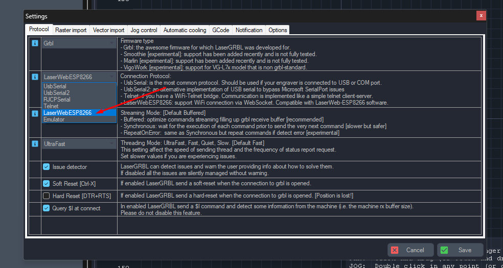

# GRBLWebBridge

This is a simple Python WebSocket bridge server designed specifically to work with LaserGRBL's built-in WebSocket client functionality. It allows you to connect to your GRBL devices (CNC machines, laser engravers, 3D printers) over a network connection rather than being limited to a direct USB connection.

## Overview

This server acts as a bridge between:
- A physical GRBL device connected to your computer via USB
- LaserGRBL software running on another computer on your network

The server exposes a WebSocket endpoint that LaserGRBL can connect to using its built-in "LaserWebESP8266" connection protocol.

## Requirements

- Python 3.7 or higher
- Python packages: `websockets`, `pyserial`
- A GRBL device connected via USB
- LaserGRBL software on a computer that can reach your server over the network

## Installation

1. Clone or download this repository
2. Install the required dependencies:
   ```
   pip install websockets pyserial
   ```

## Usage

### Running the Server

1. Connect your GRBL device to a USB port on your computer
2. Identify the serial port:
   - On Windows: COM port number (e.g., COM3)
   - On Linux/macOS: Device path (e.g., /dev/ttyUSB0)
   
3. Run the server:
   
   **Windows:**
   ```
   python server.py <COM-port-number> <websocket-port>
   ```
   Example:
   ```
   python server.py 3 8765
   ```
   This will start the server using COM3 and listen for WebSocket connections on port 8765.
   
   **Linux/macOS:**
   ```
   python server.py <device-path> <websocket-port>
   ```
   Example:
   ```
   python server.py /dev/ttyUSB0 8765
   ```

4. The server will display a WebSocket URL that you'll need to connect from LaserGRBL:
   ```
   URL: ws://192.168.1.100:8765
   ```

### Connecting from LaserGRBL

1. Open LaserGRBL on the computer you want to control your GRBL device from
2. Go to the Settings menu
3. In the "Protocol" tab, select "LaserWebESP8266"
   - This is specifically designed for WebSocket connections
   - See the image below showing where to find this option:

   
   
   *The LaserWebESP8266 option in LaserGRBL settings allows for WebSocket connections*

4. Click "Save" to apply the protocol settings
5. When prompted to select a connection, choose "Network (Ethernet/WiFi)"
6. Enter the WebSocket URL displayed by the server (e.g., `ws://192.168.1.100:8765`)
7. Connect normally and use LaserGRBL as you would with a direct connection

## Limitations

- Allows only one connected client at a time (exclusive access to the GRBL device)
- No support for multiple GRBL devices (one server per device, you can run multiple servers on different ports)
- No authentication implemented (anyone on your local network can connect to the server)

## Troubleshooting

- If the connection fails, make sure the server is running and the WebSocket URL is correct
- If the GRBL device disconnects, the server will try to reconnect automatically every 5 seconds
- If reconnection fails, verify that the device is still connected to the same port
- If the port changes, you'll need to restart the server with the new port number
- If you experience lag or performance issues, try different streaming modes in LaserGRBL

## Notes

This server is ideal for:
- Controlling your laser/CNC remotely from another room
- Sharing a single GRBL device among multiple computers
- Using LaserGRBL on a computer without direct USB access to the GRBL device